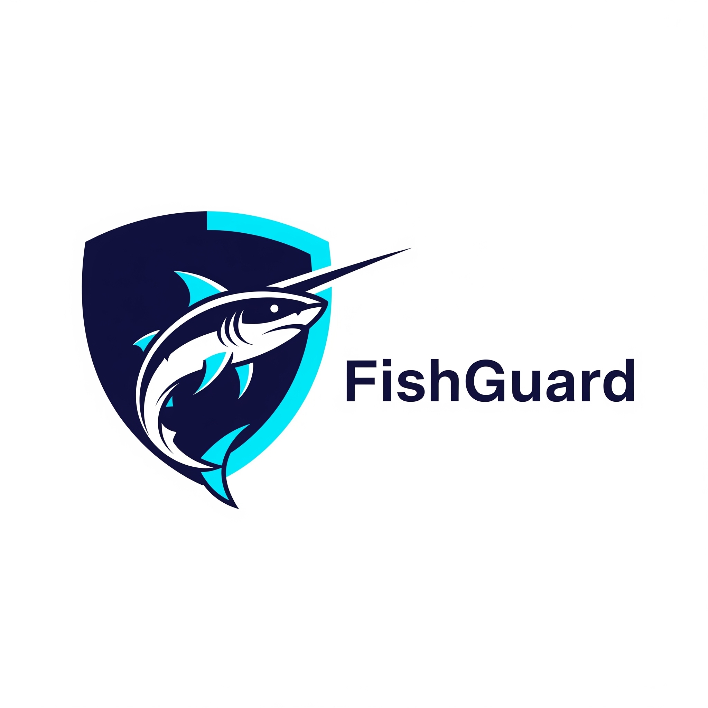
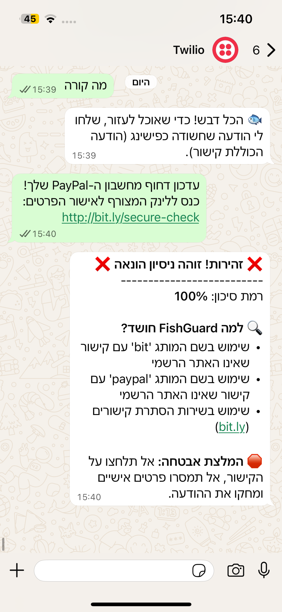
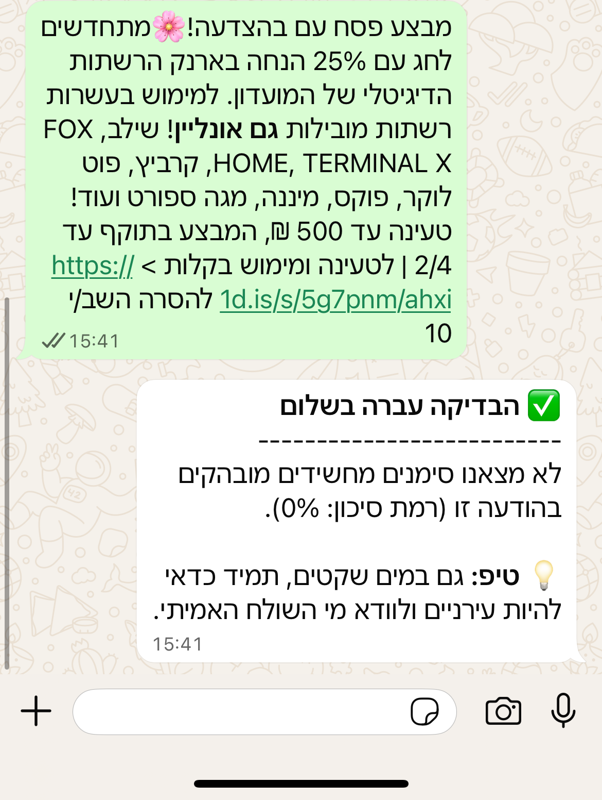

# 🐟 FishGuard - WhatsApp Fishing Protector 🛡️

  

> **Don't be the bait!** FishGuard is an intelligent WhatsApp bot designed to safeguard users against fishing and SMS scams in real-time.

---

## 🚀 Overview
In an era of sophisticated social engineering, FishGuard acts as a personal cybersecurity shield. The project focuses on identifying malicious patterns in messages, specifically targeting common scams in Israel by analyzing message content, URL structures, and sender metadata.

## 📸 Demo & Examples

### Real-world Fishing Detection
FishGuard identifying the common "Kvish 6" scam by analyzing the domain and brand context:

### Safe Link Analysis
The bot confirming a legitimate website, ensuring a smooth and secure user experience:

## ✨ Key Features
- **🔍 Smart URL Inspection:** Detects suspicious TLDs (.vip, .top, .org) and identifies link-shortening services used to hide malicious destinations.
- **🏢 Brand Consistency Check:** Cross-references brand names mentioned in text with the actual URL domain to detect impersonation (e.g., Kvish 6, Israel Post, Bit).
- **🚩 Linguistic Analysis:** Flags urgency-based tactics and common fishing phrases such as "Legal Action" or "Account Blocked".
- **🌍 Metadata Analysis:** Inspects international sender prefixes to flag suspicious origins for Hebrew-based messages.

## 🛠️ Tech Stack
- **Python 3.10** - Core detection logic.
- **Flask** - Web framework for handling incoming WhatsApp webhooks.
- **Twilio WhatsApp API** - Integration for real-time messaging.
- **PythonAnywhere** - Cloud deployment for 24/7 availability.

## 📱 Live Demo
Try FishGuard yourself! 
1. **[Click here to start the chat](https://bit.ly/4s6cuHi)**
2. Send the message **`join all-fog`** (Twilio Sandbox requirement).
3. Forward any suspicious message to the bot.

---
*Developed by Oded as a practical cybersecurity and software engineering project.*
